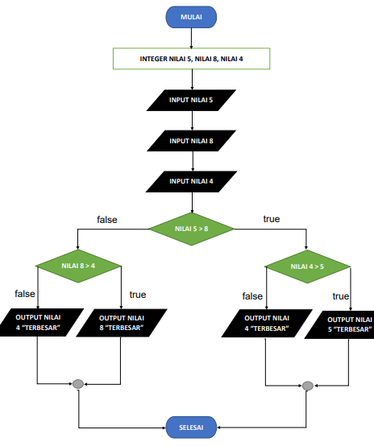

# tugas labpy02
## soal

## jawab

untuk menjawab soal tersebut saya membuat inputan nilai terlebih dahulu

    a = int(input("Masukkan bilangan 1: "))
    b = int(input("Masukkan bilangan 2: "))
    c = int(input("Masukkan bilangan 3: "))

lalu masukan angka yang diinginkan

saya memasukan 
bilangan 1 : 5
bilangan 2 : 8
bilangan 3 : 4

lalu saya membuat flowchart seperti dibawah

setelah itu saya menggunakan syntax dibawah

    N=int(input("banyaknya data = "))
    if N>0:
        i=1
        x=int(input("data ke -"+str(i)+"="))
        max=x;total=x
        for i in range(2,N+1):
            x=int (input("data ke -"+str(i)+"="))
            total+=x
            if max<x:
                max=x

        print("bilangan terbesar =",max)

## output

dari sytax diatas sehingga saya menghasilkan output

terimakasih